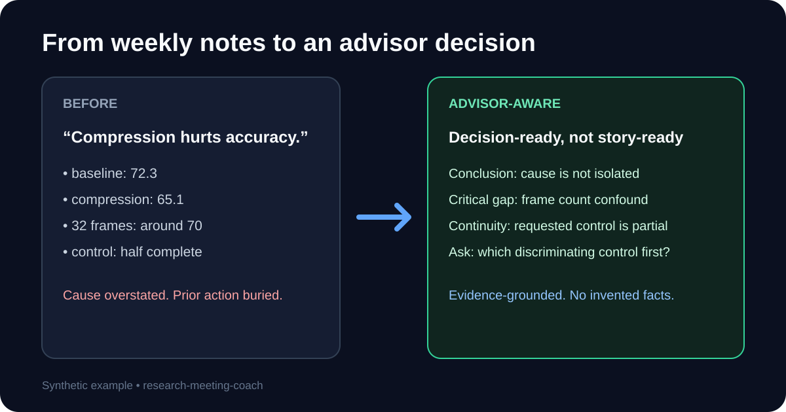

# Advisor-Aware Research Meeting Coach

**把混亂的研究進度，整理成教授能做決定的 meeting。**

[English](README.md) | [简体中文](README.zh-CN.md)


[](https://github.com/niansia/research-meeting-coach/actions/workflows/ci.yml)

你做了一週研究，但 meeting 前真正困難的通常不是「做投影片」，而是：

- 哪個結果真的值得講？
- 哪個結論證據還不夠？
- 上週教授交代的事情是否被漏掉？
- 教授最可能從哪個推理缺口追問？
- 今天到底要請教授決定什麼？

這個 Agent Skill 會把現有的週報、原始筆記或 meeting 草稿，加上一層 advisor-facing critique；它不負責把不成立的故事包裝得更漂亮。

> Early alpha：deterministic integrity checks 已通過，但尚未證明教授偏好、學生學習成效、精準預測問題，或優於 strong generic prompt。



## 30 秒看差異

輸入：

```text
baseline：72.3
compression setup：65.1
32-frame follow-up：約 70
上週教授要求的 early-frame control：只完成一半
草稿結論：「compression 會傷害 accuracy」
```

輸出不會直接接受因果結論，而會指出：

```text
觀察：三個設定的數值不同。
證據邊界：frame count 與 token budget 尚未控制，不能歸因給 compression。
延續性：上週要求的 control 仍是 partial。
Critical gap：目前的 causal claim 不成立。
今天要問教授：equal-frame 或 equal-token-budget control 先做哪個？
```

## 立即試用

目前 checkout 可直接把 `research-meeting-coach/` 目錄交給支援 Agent Skills 的 client，並使用：

```text
Use $research-meeting-coach on these notes and my previous-meeting record.
Prepare a 15-minute advisor meeting. Do not invent facts or completion.
Separate observations from interpretations, rank the reasoning gaps,
and end with one decision my advisor can answer.
```

一行安裝：

```text
npx skills add niansia/research-meeting-coach --skill research-meeting-coach
```

請在要安裝 Skill 的專案中執行。三大主流系統使用同一條安裝指令；目前 CI 固定用 `skills@1.5.23` 做乾淨安裝測試，需要 Git 與 Node.js 22.20 以上。

<details>
<summary>Windows／macOS／Linux 指令</summary>

**Windows（PowerShell）**

```powershell
npx skills add niansia/research-meeting-coach --skill research-meeting-coach
```

**macOS（Terminal）**

```bash
npx skills add niansia/research-meeting-coach --skill research-meeting-coach
```

**Linux（Terminal）**

```bash
npx skills add niansia/research-meeting-coach --skill research-meeting-coach
```

</details>

完整可重現入口：[60-second demo](research-meeting-coach/examples/60-second-demo/README.md)。

## 為什麼不直接用泛用 ChatGPT／Claude prompt？

Strong generic prompt 本來就有用，本專案也明確承認它已能抓到示例中的核心 confound。這個 Skill 的價值在於把較難穩定維持的行為做成可檢查契約：

| 泛用 meeting prompt | Advisor-Aware |
|---|---|
| 整理內容與語氣 | 找出影響教授決策的內容 |
| 容易把結果串成故事 | 拆開 observation／interpretation／hypothesis／proposal |
| 每週重新開始 | 保留上次 advisor action 與真實狀態 |
| 產生可能問題 | 依決策風險排序 reasoning gaps，不捏造機率 |
| 數字靠模型自行維持 | 驗證 output↔RMS；對 text-exact evidence 再把數值、單位、metric、condition、qualifier 與 citation 綁回 quoted source |
| 容易猜教授個性 | 只接受有紀錄行為支持的 personalization |

## 它會產出什麼？

- meeting mission 與 30 秒 opener；
- evidence boundary 與未完成的 prior action；
- `Critical / High / Medium / Low` attack surface；
- 一個教授可以回答的 decision／ask；
- main／backup／omit 對話路徑；
- `Changed / Why / Try next time` 新手 coaching；
- optional RMS JSON 與 deterministic validators。

## 實證狀態

目前有 15 個 behavioral/adversarial case definitions、8 個 routing cases、1 個 longitudinal holdout definition，以及 15 筆只供 taxonomy discovery 的公開回溯 seed。

正式 model-generated behavioral runs：0。Cross-model runs：0。具有知情同意、會前材料、凍結預測與會後問題紀錄的 paired cases：0。

因此目前可宣稱的是「auditable advisor-facing critique layer」，不能宣稱「比 generic prompt 好」或「可以預測教授」。下一個真正重要的里程碑是五個 permissioned、prospective paired meetings。

## 本機驗證

以下指令須在 clone 下來的 repository 根目錄執行，支援 Python 3.11 或 3.13。

<details open>
<summary>Windows（PowerShell）</summary>

```powershell
py -3.11 -m venv .venv
.\.venv\Scripts\python.exe -m pip install -r requirements-dev.txt
.\.venv\Scripts\python.exe research-meeting-coach\scripts\run_static_evals.py
.\.venv\Scripts\python.exe validate_repository.py --json
.\.venv\Scripts\python.exe research-meeting-coach\scripts\validate_schema_contracts.py
.\.venv\Scripts\python.exe research-meeting-coach\scripts\build_release.py --json
.\.venv\Scripts\python.exe research-meeting-coach\scripts\validate_portable_release.py --json
.\.venv\Scripts\python.exe validate_skill_install.py --json
```

</details>

<details>
<summary>macOS（Terminal）</summary>

```bash
python3 -m venv .venv
./.venv/bin/python -m pip install -r requirements-dev.txt
./.venv/bin/python research-meeting-coach/scripts/run_static_evals.py
./.venv/bin/python validate_repository.py --json
./.venv/bin/python research-meeting-coach/scripts/validate_schema_contracts.py
./.venv/bin/python research-meeting-coach/scripts/build_release.py --json
./.venv/bin/python research-meeting-coach/scripts/validate_portable_release.py --json
./.venv/bin/python validate_skill_install.py --json
```

</details>

<details>
<summary>Linux（Terminal）</summary>

```bash
python3 -m venv .venv
./.venv/bin/python -m pip install -r requirements-dev.txt
./.venv/bin/python research-meeting-coach/scripts/run_static_evals.py
./.venv/bin/python validate_repository.py --json
./.venv/bin/python research-meeting-coach/scripts/validate_schema_contracts.py
./.venv/bin/python research-meeting-coach/scripts/build_release.py --json
./.venv/bin/python research-meeting-coach/scripts/validate_portable_release.py --json
./.venv/bin/python validate_skill_install.py --json
```

</details>

GitHub Actions 會跑六組 job：Windows、Ubuntu Linux、macOS，各自搭配 Python 3.11 與 3.13；每組都會重建並解開驗證 portable ZIP，再做一次專案內安裝測試。

## 安全發布

不要直接壓縮工作目錄；`.gitignore` 不會保護 ZIP／RAR。只能使用：

```text
python -m pip install -r research-meeting-coach/requirements.txt
python research-meeting-coach/scripts/build_release.py --json
```

`validate_schema_contracts.py` 只驗 bundle 內的已知 fixtures。使用者實際執行的 `validate_rms.py` 與 `validate_advisor_profile.py` 現在會先跑 published Draft 2020-12 schema，再跑額外語意規則；缺 required field、加入 unexpected property 或缺少 `jsonschema` dependency 都會明確失敗，不會只做部分檢查後顯示 PASS。

`run_static_evals.py` 只要求 portable ZIP 內本來就應存在的檔案。Git repository checkout 另跑 `python validate_repository.py --json`，檢查 `.github` workflow、issue／PR 模板與 release checklist；這些 repository infrastructure 刻意不放進 portable Skill ZIP，CI 會同時執行兩層。

Builder 對 repository 與 Skill package 的未列名頂層路徑採預設拒絕，並排除 local register、`.env`、private/confidential pilot 檔名、symbolic link、cache、bytecode 與巢狀壓縮檔；完成 ZIP 後還會掃描 Dcard、Reddit、PTT、Threads、Facebook 的個別貼文網址，以及常見 credential/private-key pattern。

但它不是通用 PII 偵測器。通過 builder 不代表內容已匿名、已取得同意或可合法發布；仍須人工檢查 staged files 與 manifest，而且只能使用合成或明確取得許可的案例。

完整技術驗證、限制、prior art、貢獻方式與安全政策請見 [English README](README.md)、[AUDIT_REPORT.md](AUDIT_REPORT.md)、[CONTRIBUTING.md](CONTRIBUTING.md) 與 [SECURITY.md](SECURITY.md)。

MIT License。
